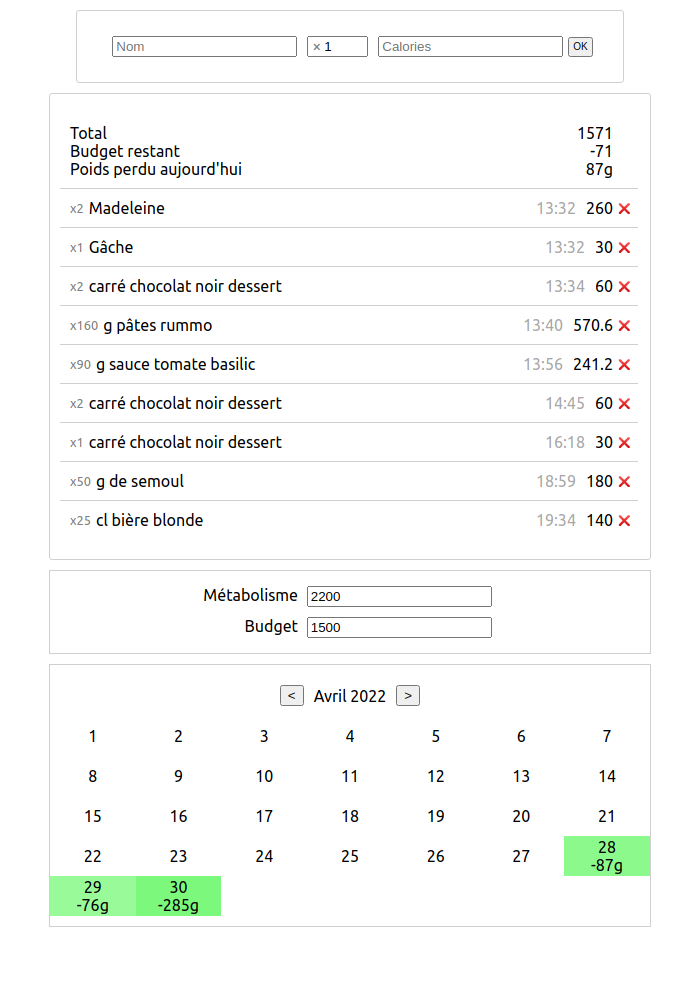

# TinyCalorie

Simplest possible calorie counter, as a web-app. Rust (back) + HTML/CSS/vanillajs (front).  
No frameworks! Very fast.

## Dockerfile

You can use the provided dockerfile for easier deployment.
This will expose it on port 8080, and store the SQLite db.db in /path/to/storage.

```bash
docker build -t tinycalorie .
docker run -p 8080:80 -v /path/to/storage:/storage tinycalorie
```
## Dockerfile on Dockerhub

### Use the prebuild image on Dockerhub
[Docker Hub Image](https://hub.docker.com/r/uriopass/tinycalorie)
```bash
docker pull uriopass/tinycalorie:1.0
```
## Use Docker-Compose File
1. Install Docker and Docker-Compose
2. Clone Repository or copy the file below to docker-compose.yml
3. run docker-compose up -d

[How to install Docker-Compose](https://docs.docker.com/compose/install/)

```
version: "3.1"

services:
  tiny-calorie:
    image: uriopass/tinycalorie:1.0
    container_name: tiny-calorie
    volumes: 
      - /path/to/storage:/storage
    networks:
      - network
    ports: 
      - 8080:80
    restart: unless-stopped
networks:
    network:
```

## Integration with Authelia und Traefik
1. Install Docker and Docker-Compose
2. Clone Repository 
3. Switch to folder Authelia-Traefik-Integration or copy the file below to docker-compose.yml
3. run docker-compose up -d

[Learn about Authelia](https://www.authelia.com/)
[Learn about Traefik](hhttps://traefik.io/)

```
version: "3.1"

services:
  tiny-calorie:
    image: uriopass/tinycalorie:1.0
    container_name: tiny-calorie
    volumes: 
      - /path/to/storage:/storage
    networks:
      - network
    expose: 
      - 80
    restart: unless-stopped
    labels:
      # Authelia-Traefik Config
      - "traefik.enable=true"
      - 'traefik.http.routers.tinycalorie.tls=true'
      - "traefik.http.routers.tinycalorie.rule=Host(`domain.TLD`)"
      - "traefik.http.routers.tinycalorie.entrypoints=websecure"
      - "traefik.http.routers.tinycalorie.service=tinycalorie"
      - "traefik.http.services.tinycalorie.loadbalancer.server.port=80"
      - "traefik.http.routers.tinycalorie.tls.certresolver=leresolver"
      - 'traefik.http.routers.tinycalorie.middlewares=authelia@docker'

networks:
  network:
    external: true
```

## Features

 - [x] Daily calorie counter
 - [x] Fuzzy search in history
 - [x] Budget/metabolism with weight tracking
 - [x] Very simple UI, quick to add/manage food items
 - [x] Mobile support, fully responsive
 - [x] Activities as negative calorie spending
 - [x] Calendar showing weight loss
 - [x] Browse history through calendar (and add items if forgotten)

## Want

 - [ ] Edit name of items (content-editable?)
 - [ ] Internationalization

## Doesn't want

 - Plugging complex food APIs to find how much calorie is a food, use the numbers at the back of the product, or infer it yourself.
 - Cluttering the interface

## Screenshot


